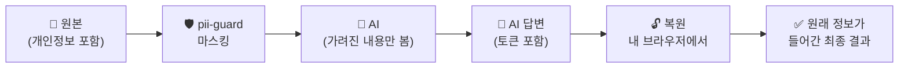

<div align="center">

# 🛡️ pii-guard

**AI에 보내기 전에, 개인정보부터 가리세요.**

질문이나 파일 속 개인정보를 마스킹하고, 파일에 열기 비밀번호를 거는 도구


[🌐 웹 도구 열기](https://sejin0211.github.io/pii-guard/) · [🐍 파이썬 도구](#-파이썬-도구) · [⚠️ 한계](#️-한계)

</div>

---

## 📑 목차

- [어떻게 동작하나요?](#-어떻게-동작하나요)
- [예시](#-예시)
- [구성](#-구성)
- [찾아서 가리는 정보](#-찾아서-가리는-정보)
- [웹 도구](#-웹-도구)
- [파이썬 도구](#-파이썬-도구)
- [비밀번호 걸기](#-비밀번호-걸기)
- [예상 질문 (FAQ)](#-예상-질문-faq)
- [한계](#️-한계)
- [저장소 사용 시 주의](#-저장소-사용-시-주의)

---

## 🔄 어떻게 동작하나요?

AI에는 가려진 내용만 보내고, 원래 정보는 내 컴퓨터 밖으로 나가지 않습니다.



## ✨ 예시

**마스킹 전**

```text
홍길동님(주민번호 900101-1234567)의 연락처는 010-1234-5678,
이메일은 gildong.hong@example.com 입니다.
```

**마스킹 후** (토큰 방식)

```text
[지정어_1]님(주민번호 [주민등록번호_1])의 연락처는 [휴대전화_1],
이메일은 [이메일_1] 입니다.
```

같은 값은 항상 같은 토큰으로 바뀌기 때문에, AI도 "`[지정어_1]`과 `[지정어_2]`는 다른 사람"처럼 관계를 구분해서 답할 수 있습니다.
별표(`*`) 방식을 고르면 토큰 대신 `*`로 지워지며, 이 경우 복원은 불가능합니다.

## 📦 구성

| 파일 | 설명 |
|---|---|
| `index.html` | 🌐 **웹 도구** — **텍스트 마스킹 · 파일 마스킹(Word, Excel, PDF)**, 원본 복원 |
| `pii_guard.py` | 🐍 **파이썬 도구** — Word, Excel, PDF, 텍스트 파일 마스킹과 비밀번호 설정 |
| `test_samples/` | 🧪 가짜 개인정보로 만든 테스트 파일 (docx, xlsx, pdf, txt) |

## 🔍 찾아서 가리는 정보

| 자동 탐지 | 예시 형태 |
|---|---|
| 주민등록번호 | `900101-1234567` |
| 카드번호 | `1234-5678-9012-3456` |
| 휴대전화 · 일반전화 | `010-1234-5678` · `02-123-4567` |
| 이메일 | `name@example.com` |
| 사업자등록번호 | `123-45-67890` |
| 여권번호 | `M12345678` |
| IP 주소 | `192.168.0.15` |
| 계좌번호 | `110-123-456789` |

> [!NOTE]
> 이름과 회사명은 자동으로 찾을 수 없습니다. 웹 도구의 **"추가로 가릴 단어"** 칸이나 `--words` 옵션에 직접 입력하세요.
> `2026-09-29` 같은 날짜는 계좌번호로 오인하지 않도록 제외합니다.

## 🌐 웹 도구

브라우저에서 `index.html`을 열거나 [배포된 페이지](https://sejin0211.github.io/pii-guard/)에 접속하세요. 입력한 내용은 서버로 전송되지 않습니다.

<details>
<summary><b>📝 텍스트 마스킹</b></summary>

1. 텍스트를 붙여넣거나 텍스트 파일(`txt` `csv` `md` `json` `log` `tsv`)을 불러옵니다.
2. 가릴 이름이 있으면 "추가로 가릴 단어"에 쉼표로 구분해 입력합니다.
3. 가리는 방식을 고르고 **마스킹하기**를 누릅니다.

| 방식 | 결과 | 복원 |
|---|---|---|
| 토큰 치환 | `[휴대전화_1]` | ✅ 가능 |
| 별표(`*`) 치환 | `***-****-****` | ❌ 불가 |
| 일부만 가리기 | `010-****-5678` | ❌ 불가 |

4. 결과를 복사하거나 파일로 저장해 AI에 보냅니다.

- **🧪 샘플 넣기**: 가짜 개인정보가 든 예시를 한 번에 넣어 바로 체험할 수 있습니다. 파일 탭에는 샘플 파일 4종이 들어 있습니다.
- **항목 켜고 끄기**: "자동 탐지" 칩을 눌러 가리지 않을 항목(예: 이메일)을 끌 수 있습니다.
- **재검사**: 마스킹이 끝나면 결과를 다시 검사해 남은 항목을 알려 줍니다. 파일은 시트 이름, 수식, 링크 주소, 그림 대체 텍스트까지 확인합니다.

</details>

<details>
<summary><b>📁 파일 마스킹 (Word · Excel · PDF)</b></summary>

1. **2. 파일 마스킹** 탭에서 파일을 끌어다 놓거나 선택합니다. 여러 개를 한 번에 처리할 수 있습니다.
2. 가릴 이름을 입력하고 방식을 고른 뒤 **파일 마스킹하기**를 누릅니다.
3. 결과 목록에서 파일별로 **다운로드**합니다.

| 형식 | 처리 방식 |
|---|---|
| Word (`.docx`) | 서식은 그대로 두고 본문·표·머리글·바닥글·각주·댓글·텍스트 상자의 내용을 가립니다. |
| Excel (`.xlsx`) | 서식은 그대로 두고 셀과 메모의 내용을 가립니다. 숫자로 저장된 주민번호도 처리합니다. |
| PDF | 글자만 추출해 `.txt`로 저장합니다. |
| 텍스트 (`.txt` `.csv` `.md` `.json` `.log` `.tsv`) | 그대로 처리합니다. EUC-KR 파일은 UTF-8로 변환해 저장합니다. |

"문서 속성 지우기"를 켜 두면 Word·Excel의 작성자, 마지막 수정자, 회사 정보도 함께 지웁니다.
토큰 방식으로 가린 값은 같은 페이지의 텍스트 탭 **④ 복원**에서 되돌릴 수 있습니다.

</details>

<details>
<summary><b>🔓 원본 복원</b></summary>

토큰 방식으로 마스킹했다면, AI 답변을 **"AI 답변에서 원래 정보 복원하기"** 에 붙여넣어 토큰을 원래 값으로 되돌릴 수 있습니다.

> [!IMPORTANT]
> 대응표는 페이지를 열어 둔 동안만 유지됩니다. 새로고침하거나 닫으면 사라지니, 그 전에 복원하세요.

</details>

## 🐍 파이썬 도구

웹 도구에서도 파일 마스킹을 할 수 있지만, 여러 파일을 명령 한 번으로 처리하거나 파일에 비밀번호를 걸려면 이 도구를 쓰세요.

```bash
pip install python-docx openpyxl pypdf cryptography msoffcrypto-tool
python pii_guard.py 파일1 [파일2 ...] [옵션]
```

**예시**

```bash
python pii_guard.py 상담기록.docx 신청자.xlsx --words 홍길동,김영희
```

**옵션**

| 옵션 | 설명 |
|---|---|
| `--words 홍길동,김영희` | 자동으로 못 찾는 이름·회사명 등을 추가로 가림 |
| `--star` | 토큰 대신 별표(`*`)로 가림 (복원 불가) |
| `--map` | 토큰과 원래 값의 대응표(`_map.json`)를 저장 ⚠️ 개인정보가 들어 있으니 따로 보관 |
| `--lock` | 마스킹과 함께, 개인정보가 든 **원본**에 열기 비밀번호를 걸어 `이름_locked.확장자`로 저장 |
| `--lock-only` | 마스킹 없이 비밀번호만 설정 |

**지원 형식** — 원본은 수정하지 않고 `이름_masked.확장자`로 새로 저장합니다.

| 형식 | 처리 방식 |
|---|---|
| 📘 Word (`.docx`) | 본문, 표, 머리글·바닥글 (서식 유지) |
| 📗 Excel (`.xlsx`) | 셀 값 (숫자로 저장된 주민번호·카드번호 포함) |
| 📕 PDF (`.pdf`) | 글자만 추출해 `이름_pdf_masked.txt`로 저장 |
| 📄 텍스트 (`.txt` `.csv` `.md` `.json` `.log` `.tsv`) | 그대로 처리 |

## 🔒 비밀번호 걸기

파일 자체에 **열기 비밀번호**를 겁니다. 별도 프로그램 없이 Word, Excel, PDF 프로그램에서 파일을 열 때 비밀번호를 묻습니다.

```bash
# 마스킹하면서, 개인정보가 든 원본에 비밀번호 걸기
python pii_guard.py 상담기록.docx --words 홍길동 --lock

# 마스킹 없이 비밀번호만 걸기
python pii_guard.py 상담기록.docx 신청자.xlsx 계약서.pdf --lock-only
```

- 결과는 `이름_locked.확장자`로 저장되고, 원본은 그대로 남습니다.
- 지원 형식: `docx` `xlsx` `pdf`
- 비밀번호는 8자 이상이며, 실행 시 두 번 입력합니다.

> [!WARNING]
> 비밀번호를 잃으면 파일을 열 수 없습니다. 원본을 지우기 전에 잠근 파일이 열리는지 꼭 확인하세요.

> [!NOTE]
> 잠근 파일은 AI가 읽을 수 없습니다. AI에는 마스킹한 파일(`_masked`)을 보내세요.

## ❓ 예상 질문 (FAQ)

발표나 검토 때 나올 수 있는 질문과 답변입니다. 제목을 누르면 답변이 펼쳐집니다.

### 🔐 보안 · 개인정보

<details>
<summary><b>Q. 정말 입력한 내용이 서버로 전송되지 않나요? 어떻게 증명하나요?</b></summary>

전송하지 않습니다. 모든 처리는 브라우저 안의 JavaScript로 이루어지고, 페이지 코드에는 외부로 데이터를 보내는 부분이 없습니다.

- **직접 확인하는 방법**: 브라우저 개발자 도구(F12) → **Network** 탭을 연 상태로 마스킹해 보세요. 처리 중에 외부 주소로 나가는 요청이 없습니다.
- **개발 중 확인 결과**: 텍스트·파일 마스킹 전 과정을 자동으로 실행하며 네트워크 요청을 기록했고, 외부(http/https) 요청은 0건이었습니다.
- **완전 오프라인 사용**: `index.html` 파일 하나만 내려받아 인터넷을 끊고 열어도 모든 기능이 동작합니다. 필요한 라이브러리가 파일 안에 들어 있어 외부 CDN을 불러오지 않습니다.

> 참고: GitHub Pages로 접속하면 페이지를 **내려받는** 과정에서 GitHub가 접속 기록(IP 등)을 남길 수 있습니다. 입력한 내용과는 무관하지만, 이것도 원치 않으면 파일을 내려받아 로컬에서 쓰세요.

</details>

<details>
<summary><b>Q. 토큰과 원래 값의 대응표(복원 정보)는 어디에 저장되나요?</b></summary>

**브라우저 탭의 메모리에만** 있습니다. 파일, 쿠키, 브라우저 저장소 어디에도 기록하지 않으며, 탭을 새로고침하거나 닫으면 사라집니다.
편의성(나중에 복원)보다 유출 위험을 줄이는 쪽을 택한 설계입니다.

파이썬 도구는 `--map` 옵션을 줬을 때만 대응표 파일(`_map.json`)을 만들고, 이 파일에는 원래 개인정보가 들어 있으므로 따로 보관해야 합니다.

</details>

<details>
<summary><b>Q. 토큰으로 바꾸면 안전한가요? AI가 문맥으로 누군지 알아낼 수 있지 않나요?</b></summary>

알아낼 수 있습니다. 이 도구는 **직접 식별자**(이름, 번호, 연락처)를 가리지만, **간접 식별자**는 가리지 않습니다.

예: “[지정어_1]은 ○○학과 3학년 유일한 외국인 여학생이며 지난달 장학금 부정수급 건으로…”
→ 이름이 가려져도 학과·학년·특징·사건만으로 특정 인물을 알아볼 수 있습니다.

따라서 AI에 보낼 때는 **목적에 필요 없는 세부 정보도 함께 지우거나 일반화**해야 합니다. 이 도구는 그 작업의 일부를 자동화할 뿐입니다.

</details>

<details>
<summary><b>Q. 공개 GitHub 저장소에 올려도 되나요? 코드가 공개되면 위험하지 않나요?</b></summary>

코드에는 비밀번호, API 키, 개인정보가 없어서 공개되어도 문제가 없습니다. 탐지 규칙이 공개되는 것도 위험 요소가 아닙니다. 이 도구는 공격을 막는 장치가 아니라 **사용자가 실수로 개인정보를 보내는 것을 줄이는 도구**이기 때문입니다.

위험한 것은 **실제 데이터가 저장소에 올라가는 것**입니다. `.gitignore` 설정([저장소 사용 시 주의](#-저장소-사용-시-주의))을 꼭 적용하세요. `test_samples/`는 모두 가짜 정보입니다.

</details>

### 🎯 정확도

<details>
<summary><b>Q. 정규식 기반인데, 개인정보를 얼마나 정확하게 찾나요? 누락률은?</b></summary>

**누락률을 수치로 제시할 수 없습니다.** 실제 업무 문서로 검증하지 않았고, 가짜 정보로 만든 샘플로만 테스트했기 때문입니다.

정규식은 **정해진 형식**(예: `010-1234-5678`)은 확실히 찾지만, 형식에서 벗어나면 놓칩니다.

| 놓치는 예 | 이유 |
|---|---|
| `공일공-1234-5678`, `010 1234 5678 (띄어쓰기 여러 칸)` | 형식이 다름 |
| `010-1234-` / `5678` (줄이 나뉨) | 한 덩어리가 아님 |
| 이미지·스캔본 안의 글자 | 글자 데이터가 아님 |
| 이름, 주소, 학번, 외국인등록번호 | 아직 규칙이 없음 (아래 참고) |

그래서 이 도구는 **사람의 검토를 대체하지 않고 보조**합니다. 결과는 반드시 눈으로 확인하세요.

</details>

<details>
<summary><b>Q. 재검사에서 ✅가 나오면 안전하다고 봐도 되나요?</b></summary>

아니요. 재검사도 **같은 정규식**을 쓰기 때문에, 처음부터 형식이 달라 못 찾은 정보는 재검사에서도 못 찾습니다.

재검사가 잡아내는 것은 주로 이런 경우입니다.
- 가리는 작업이 닿지 않는 곳에 남은 정보: 엑셀 **시트 이름, 수식**, Word **변경 내용 추적의 삭제된 글자**, 그림 **대체 텍스트**, 차트 제목 등
- 사용자가 꺼 둔 항목 (ℹ️로 따로 안내)

즉 ✅는 “이 도구가 아는 형식은 남아 있지 않다”는 뜻이지, “개인정보가 없다”는 뜻이 아닙니다.

</details>

<details>
<summary><b>Q. 이름은 왜 자동으로 못 찾나요? AI(개체명 인식)를 쓰면 되지 않나요?</b></summary>

한국어 이름은 형식으로 구분하기 어렵습니다. `김`, `이`, `정`처럼 흔한 글자와 겹치고 “정상”, “이상”, “김치” 같은 일반 단어와 구분할 수 없어, 규칙으로 찾으면 오탐이 매우 많아집니다.

개체명 인식(NER) 모델을 쓰면 정확도가 올라가지만,
- 브라우저에서 돌리려면 수십~수백 MB의 모델을 받아야 하고,
- 외부 AI API를 쓰면 **개인정보를 가리기 위해 개인정보를 외부로 보내는** 모순이 생깁니다.

그래서 현재는 가릴 이름을 사용자가 직접 입력하는 방식을 택했습니다. 이름 **후보를 찾아 제안**하는 기능은 개선 계획에 있습니다.

</details>

<details>
<summary><b>Q. 개인정보가 아닌데 가려지는 경우(오탐)는 없나요?</b></summary>

있을 수 있습니다. 예를 들어 `123-45-67890` 형식의 문서번호는 사업자번호로, 하이픈으로 이어진 숫자는 계좌번호로 가려질 수 있습니다. `2026-09-29` 같은 날짜는 계좌번호로 오인하지 않도록 제외했습니다.

오탐이 문제가 되면 해당 항목의 칩을 눌러 **끄면** 됩니다. 꺼 둔 항목은 다른 규칙에 걸려 잘못 가려지지 않도록 처리되어 있습니다.

</details>

<details>
<summary><b>Q. AI가 답변에서 토큰을 조금 바꿔 쓰면 복원이 되나요?</b></summary>

안 됩니다. 복원은 `[지정어_1]`과 **글자가 정확히 같을 때만** 동작합니다. AI가 `[지정어 1]`, `지정어_1`, `[이름_1]`처럼 바꿔 쓰면 그 부분은 복원되지 않고 그대로 남습니다.

AI에 요청할 때 “대괄호로 된 표시는 바꾸지 말고 그대로 써 줘”라고 덧붙이면 대부분 해결됩니다. 복원 후에는 남은 토큰이 없는지 확인하세요.

</details>

### ⚖️ 법 · 규정

<details>
<summary><b>Q. 이 도구로 처리하면 개인정보보호법상 가명처리·비식별 조치를 한 것인가요?</b></summary>

**아닙니다.** 이 도구는 법적 가명처리·익명처리 요건을 충족한다고 보장하지 않습니다.

법에서 말하는 가명처리는 결과물뿐 아니라 **처리 목적, 추가정보(대응표)의 분리 보관, 재식별 가능성 검토, 기록 관리** 같은 절차를 함께 요구합니다. 이 도구는 그중 “식별자를 바꾸는 작업”을 돕는 수단일 뿐입니다.

업무 데이터를 외부 AI에 입력해도 되는지는 **기관의 개인정보 처리 지침과 AI 이용 가이드라인**을 먼저 확인하고, 필요하면 개인정보보호 담당 부서와 상의하세요.

</details>

<details>
<summary><b>Q. 가려서 보내면 어떤 데이터든 외부 AI에 넣어도 되나요?</b></summary>

아니요. 개인정보를 가려도 **내부 기밀, 미공개 정책, 평가 정보, 계약 조건** 같은 정보는 그대로 남습니다. 이 도구는 개인정보만 다루며, 외부 AI 사용 가능 여부 자체를 판단해 주지 않습니다.

</details>

### 🛠️ 기술 · 운영

<details>
<summary><b>Q. 어떤 브라우저에서 동작하나요?</b></summary>

개발 중 **Chromium(Chrome·Edge 계열)** 에서 자동 테스트했습니다. Safari와 Firefox는 테스트하지 않았습니다.

코드가 최신 기능(정규식의 뒤쪽 확인, CSS `:has`)을 쓰기 때문에 오래된 브라우저에서는 동작하지 않을 수 있습니다. 최신 버전의 Chrome 또는 Edge를 권장합니다.

</details>

<details>
<summary><b>Q. 큰 파일이나 많은 파일도 처리할 수 있나요?</b></summary>

브라우저 메모리 안에서 처리하므로 PC 성능과 파일 크기에 따라 달라집니다. **작은 샘플 파일로만 테스트했고, 대용량 파일의 처리 한도는 측정하지 않았습니다.** 수백 쪽짜리 PDF나 수만 행의 엑셀은 느리거나 브라우저가 멈출 수 있으니, 여러 파일로 나누거나 파이썬 도구를 사용하세요.

</details>

<details>
<summary><b>Q. 외부 라이브러리를 쓰나요? 라이선스와 공급망 보안은요?</b></summary>

두 가지를 **파일 안에 포함**해서 씁니다. 실행 중에 외부에서 불러오지 않으므로, 배포 후 CDN이 바뀌거나 변조될 위험이 없습니다.

| 라이브러리 | 용도 | 버전 | 라이선스 |
|---|---|---|---|
| JSZip | Word·Excel 파일(압축 XML) 읽기·쓰기 | 3.10.1 | MIT 또는 GPLv3 중 선택 |
| pdf.js | PDF 글자 추출 | 5.6.205 | Apache-2.0 |

대신 라이브러리 보안 업데이트가 자동으로 반영되지 않으므로, 주기적으로 버전을 확인해 교체해야 합니다.

</details>

<details>
<summary><b>Q. 웹 도구와 파이썬 도구는 뭐가 다른가요? 왜 두 개인가요?</b></summary>

| 기능 | 웹 도구 | 파이썬 도구 |
|---|---|---|
| 설치 | 필요 없음 | Python과 라이브러리 설치 |
| 텍스트·파일 마스킹 | ✅ | ✅ |
| 일부만 가리기, 항목 끄기, 재검사, 샘플 | ✅ | ❌ |
| 답변 복원 | ✅ | ❌ (대응표 저장만 가능) |
| 파일에 비밀번호 걸기 | ❌ | ✅ (`--lock`) |
| 여러 파일 명령 한 번으로 처리 | 끌어다 놓기로 가능 | ✅ (자동화·일괄 처리에 적합) |

일반 사용자는 웹 도구를, 반복 작업 자동화나 비밀번호 설정이 필요하면 파이썬 도구를 쓰면 됩니다.

> 솔직한 한계: 탐지 규칙이 두 곳(`index.html`, `pii_guard.py`)에 따로 있어서, 규칙을 고칠 때 두 곳을 함께 고쳐야 합니다. 규칙을 한 파일로 모으는 것이 개선 과제입니다.

</details>

<details>
<summary><b>Q. 새로운 탐지 항목(예: 학번)은 어떻게 추가하나요?</b></summary>

`index.html`과 `pii_guard.py`의 `RULES` 목록에 이름과 정규식을 한 줄 추가하면 됩니다. 예를 들어 10자리 학번이라면:

```js
['학번', /(?<!\d)20\d{8}(?!\d)/g],
```

단, 학번처럼 **단순한 숫자열은 다른 숫자와 헷갈리기 쉬워** 오탐이 늘 수 있습니다. 실제 형식에 맞게 좁히고, 샘플로 충분히 시험한 뒤 적용하세요. 규칙의 **순서**도 결과에 영향을 줍니다(먼저 나온 규칙이 우선).

</details>

<details>
<summary><b>Q. 어떻게 테스트했나요?</b></summary>

- 가짜 개인정보로 만든 Word·Excel·PDF·텍스트 샘플(`test_samples/`)로 테스트했습니다.
- 브라우저 자동화(Playwright)로 실제 버튼을 눌러 마스킹·복원·다운로드를 실행하고, 결과 파일에 개인정보가 남았는지 별도 코드로 다시 확인했습니다.
- 서식이 쪼개진 전화번호, 숫자로 저장된 주민번호, 날짜, 하이퍼링크 주소, 시트 이름에 숨긴 번호 같은 **까다로운 경우**를 일부러 만들어 확인했습니다.
- 결과 파일이 LibreOffice에서 정상으로 열리는지 확인했습니다.

**하지 않은 것**: 실제 업무 문서 검증, Microsoft Word·Excel에서 직접 열기, Safari·Firefox, 대용량 파일, Word·Excel 비밀번호 잠금(`--lock`) 기능.

</details>

### 🧭 한계와 계획

<details>
<summary><b>Q. 한글(.hwp) 파일은요? 구버전 .doc, .xls는요?</b></summary>

현재는 지원하지 않습니다.
- `.hwpx`(최신 한글)는 Word처럼 압축된 XML이라 같은 방식으로 추가할 수 있어 **다음 개선 1순위**입니다.
- `.hwp`, `.doc`, `.xls`는 이진 형식이라 브라우저에서 안전하게 수정하기 어렵습니다. 최신 형식(.hwpx, .docx, .xlsx)으로 저장한 뒤 사용하세요.

</details>

<details>
<summary><b>Q. 앞으로 무엇을 개선할 계획인가요?</b></summary>

1. **탐지 항목 추가**: 학번·사번, 외국인등록번호, 생년월일, 주소, 차량번호
2. **검토 후 마스킹**: 찾은 항목을 원문에 색으로 표시하고, 하나씩 확인한 뒤 가리기
3. **이름 후보 제안**: “○○○ 님/씨/교수” 같은 패턴으로 이름 후보를 찾아 보여 주기
4. **한글(.hwpx), PowerPoint(.pptx) 지원**
5. **탐지 규칙 파일 통합**: 웹·파이썬 도구가 같은 규칙을 쓰도록

</details>

## ⚠️ 한계

> [!WARNING]
> 정규식 기반이라 형식이 특이한 정보는 놓칠 수 있습니다. **AI에 보내기 전에 결과를 직접 확인하세요.**

- PDF는 원래 레이아웃이 사라지고, 스캔본은 OCR이 필요해서 처리되지 않습니다. 표에서 줄바꿈으로 단어 중간이 끊기면 일부가 남을 수 있습니다.
- Word의 텍스트 상자·각주·댓글, Excel의 메모는 아직 처리하지 않습니다.
- 웹 도구의 PDF 처리는 최신 Chrome·Edge에서 동작하며, 그 외 브라우저에서는 파이썬 도구를 사용하세요.
- 이미지 속 글자, Excel의 차트·도형 글자, 시트 이름은 처리하지 않습니다.
- 파이썬 도구에는 아직 복원 기능이 없습니다.

## 🚫 저장소 사용 시 주의

> [!CAUTION]
> 이 저장소에 **실제 개인정보가 든 파일을 올리지 마세요.** `test_samples/`의 파일은 모두 가짜 정보입니다.

실수로 올리는 일을 막으려면 `.gitignore`에 아래 내용을 추가하세요.

```gitignore
*_masked.*
*_map.json
*_locked.*
```
