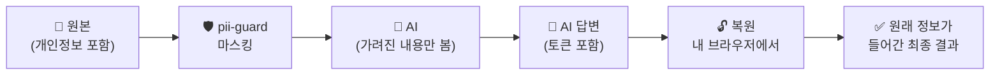

<div align="center">

# 🛡️ pii-guard

**AI에 보내기 전에, 개인정보부터 가리세요.**

질문이나 파일 속 개인정보를 마스킹하고, 파일을 암호화하는 도구


[🌐 웹 도구 열기](https://내아이디.github.io/pii-guard/) · [🐍 파이썬 도구](#-파이썬-도구) · [⚠️ 한계](#️-한계)

</div>

---

## 📑 목차

- [어떻게 동작하나요?](#-어떻게-동작하나요)
- [예시](#-예시)
- [구성](#-구성)
- [찾아서 가리는 정보](#-찾아서-가리는-정보)
- [웹 도구](#-웹-도구)
- [파이썬 도구](#-파이썬-도구)
- [`.enc` 파일 열기](#-enc-파일-열기)
- [한계](#️-한계)
- [저장소 사용 시 주의](#-저장소-사용-시-주의)

---

## 🔄 어떻게 동작하나요?

AI에는 가려진 내용만 보내고, 원래 정보는 내 컴퓨터 밖으로 나가지 않습니다.



## ✨ 예시

**마스킹 전**

```text
홍길동님(주민번호 900101-1234567)의 연락처는 010-1234-5678,
이메일은 gildong.hong@example.com 입니다.
```

**마스킹 후** (토큰 방식)

```text
[지정어_1]님(주민번호 [주민등록번호_1])의 연락처는 [휴대전화_1],
이메일은 [이메일_1] 입니다.
```

같은 값은 항상 같은 토큰으로 바뀌기 때문에, AI도 "`[지정어_1]`과 `[지정어_2]`는 다른 사람"처럼 관계를 구분해서 답할 수 있습니다.
별표(`*`) 방식을 고르면 토큰 대신 `*`로 지워지며, 이 경우 복원은 불가능합니다.

## 📦 구성

| 파일 | 설명 |
|---|---|
| `index.html` | 🌐 **웹 도구** — 텍스트 마스킹, 원본 복원, 파일 암호화·복호화 |
| `pii_guard.py` | 🐍 **파이썬 도구** — Word, Excel, PDF, 텍스트 파일 마스킹과 원본 암호화 |
| `test_samples/` | 🧪 가짜 개인정보로 만든 테스트 파일 (docx, xlsx, pdf, txt) |

## 🔍 찾아서 가리는 정보

| 자동 탐지 | 예시 형태 |
|---|---|
| 주민등록번호 | `900101-1234567` |
| 카드번호 | `1234-5678-9012-3456` |
| 휴대전화 · 일반전화 | `010-1234-5678` · `02-123-4567` |
| 이메일 | `name@example.com` |
| 사업자등록번호 | `123-45-67890` |
| 여권번호 | `M12345678` |
| IP 주소 | `192.168.0.15` |
| 계좌번호 | `110-123-456789` |

> [!NOTE]
> 이름과 회사명은 자동으로 찾을 수 없습니다. 웹 도구의 **"추가로 가릴 단어"** 칸이나 `--words` 옵션에 직접 입력하세요.
> `2026-09-29` 같은 날짜는 계좌번호로 오인하지 않도록 제외합니다.

## 🌐 웹 도구

브라우저에서 `index.html`을 열거나 [배포된 페이지](https://내아이디.github.io/pii-guard/)에 접속하세요. 입력한 내용은 서버로 전송되지 않습니다.

<details>
<summary><b>📝 텍스트 마스킹</b></summary>

1. 텍스트를 붙여넣거나 텍스트 파일(`txt` `csv` `md` `json` `log` `tsv`)을 불러옵니다.
2. 가릴 이름이 있으면 "추가로 가릴 단어"에 쉼표로 구분해 입력합니다.
3. 가리는 방식을 고르고 **마스킹하기**를 누릅니다.

| 방식 | 결과 | 복원 |
|---|---|---|
| 토큰 치환 | `[휴대전화_1]` | ✅ 가능 |
| 별표(`*`) 치환 | `***-****-****` | ❌ 불가 |

4. 결과를 복사하거나 파일로 저장해 AI에 보냅니다.

</details>

<details>
<summary><b>🔓 원본 복원</b></summary>

토큰 방식으로 마스킹했다면, AI 답변을 **"AI 답변에서 원래 정보 복원하기"** 에 붙여넣어 토큰을 원래 값으로 되돌릴 수 있습니다.

> [!IMPORTANT]
> 대응표는 페이지를 열어 둔 동안만 유지됩니다. 새로고침하거나 닫으면 사라지니, 그 전에 복원하세요.

</details>

<details>
<summary><b>🔐 파일 암호화 · 복호화</b></summary>

파일과 비밀번호(8자 이상)를 넣고 **암호화** 또는 **복호화**를 누릅니다.

- 암호화: AES-256-GCM, 키는 PBKDF2-SHA256(25만 회)으로 생성
- 원래 파일명도 암호문 안에 숨겨져서, 결과 파일은 `encrypted_숫자.enc`로 저장됩니다.

> [!WARNING]
> 비밀번호를 잃으면 파일을 복구할 수 없습니다.

</details>

## 🐍 파이썬 도구

Word, Excel, PDF 파일은 웹 도구가 아니라 이 도구로 처리합니다.

```bash
pip install python-docx openpyxl pypdf cryptography
python pii_guard.py 파일1 [파일2 ...] [옵션]
```

**예시**

```bash
python pii_guard.py 상담기록.docx 신청자.xlsx --words 홍길동,김영희
```

**옵션**

| 옵션 | 설명 |
|---|---|
| `--words 홍길동,김영희` | 자동으로 못 찾는 이름·회사명 등을 추가로 가림 |
| `--star` | 토큰 대신 별표(`*`)로 가림 (복원 불가) |
| `--map` | 토큰과 원래 값의 대응표(`_map.json`)를 저장 ⚠️ 개인정보가 들어 있으니 따로 보관 |
| `--encrypt` | 개인정보가 든 **원본**을 비밀번호로 암호화한 `.enc` 파일도 함께 생성 |

**지원 형식** — 원본은 수정하지 않고 `이름_masked.확장자`로 새로 저장합니다.

| 형식 | 처리 방식 |
|---|---|
| 📘 Word (`.docx`) | 본문, 표, 머리글·바닥글 (서식 유지) |
| 📗 Excel (`.xlsx`) | 셀 값 (숫자로 저장된 주민번호·카드번호 포함) |
| 📕 PDF (`.pdf`) | 글자만 추출해 `이름_pdf_masked.txt`로 저장 |
| 📄 텍스트 (`.txt` `.csv` `.md` `.json` `.log` `.tsv`) | 그대로 처리 |

## 🗝️ `.enc` 파일 열기

`.enc`는 이 도구로 암호화한 파일입니다. 일반 프로그램에서는 열리지 않습니다.

1. 웹 도구의 **파일 암호화·복호화** 탭을 엽니다.
2. `.enc` 파일을 선택하고 암호화할 때 쓴 비밀번호를 입력합니다.
3. **복호화**를 누르면 원래 파일명 그대로 저장됩니다.

파이썬 도구의 `--encrypt`로 만든 `.enc`도 같은 방법으로 열 수 있습니다.

## ⚠️ 한계

> [!WARNING]
> 정규식 기반이라 형식이 특이한 정보는 놓칠 수 있습니다. **AI에 보내기 전에 결과를 직접 확인하세요.**

- PDF는 원래 레이아웃이 사라지고, 스캔본은 OCR이 필요해서 처리되지 않습니다. 표에서 줄바꿈으로 단어 중간이 끊기면 일부가 남을 수 있습니다.
- Word의 텍스트 상자·각주·댓글, Excel의 메모는 아직 처리하지 않습니다.
- Word, Excel, PDF는 웹 도구에서 처리되지 않습니다.
- 파이썬 도구에는 아직 복원 기능과 복호화 기능이 없습니다.

## 🚫 저장소 사용 시 주의

> [!CAUTION]
> 이 저장소에 **실제 개인정보가 든 파일을 올리지 마세요.** `test_samples/`의 파일은 모두 가짜 정보입니다.

실수로 올리는 일을 막으려면 `.gitignore`에 아래 내용을 추가하세요.

```gitignore
*_masked.*
*_map.json
*.enc
```
